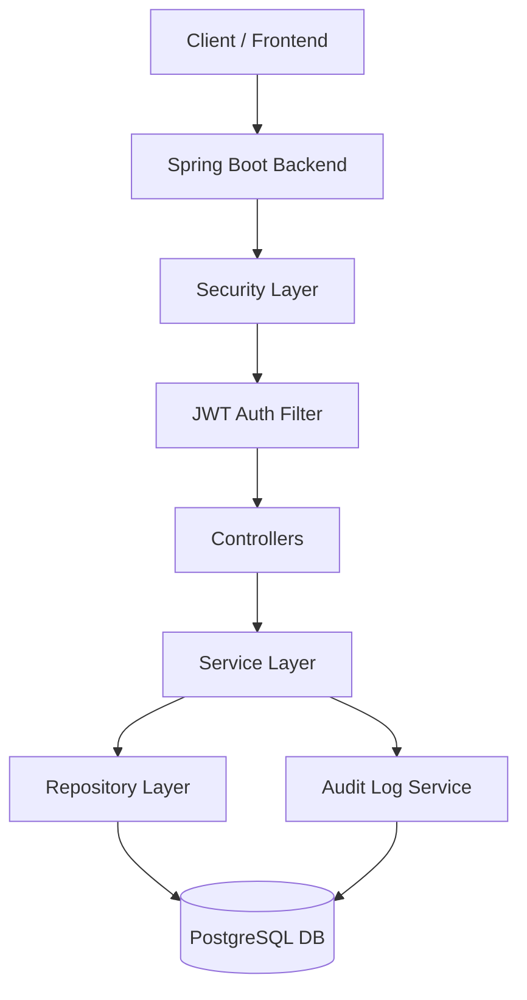
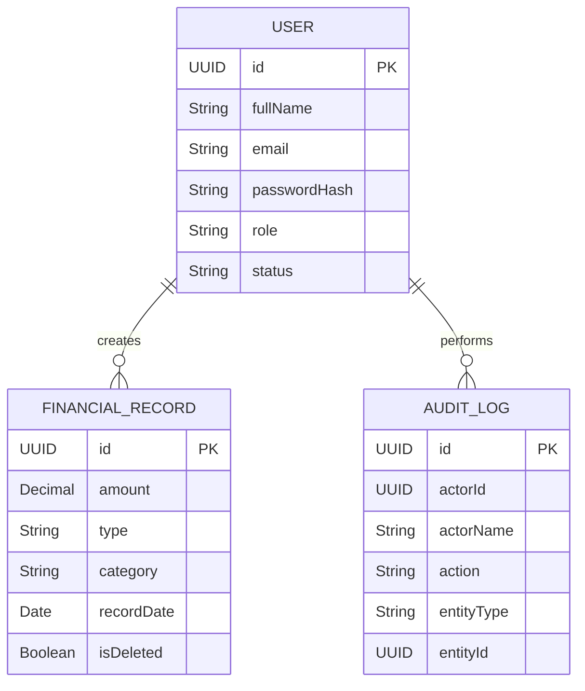

# 🚀 Finance Dashboard Backend

A **production-ready Spring Boot backend** for a finance management system with secure authentication, role-based access control, analytics dashboard, and advanced audit logging.

Designed using **real-world backend architecture principles** focusing on scalability, security, and maintainability.

---

## 🔥 Key Features

### 🔐 Authentication & Security

* JWT-based authentication (Access + Refresh Tokens)
* Role-based access control (ADMIN / ANALYST / VIEWER)
* Spring Security integration
* Stateless session management
* Secure API endpoints

### 👥 User Management

* Create, update, deactivate users (ADMIN only)
* Fetch current user profile
* Soft deactivation (no hard delete)

### 💳 Financial Records

* Full CRUD operations
* INCOME / EXPENSE tracking
* Category-based classification
* Accurate calculations using **BigDecimal**
* Date-based filtering & search

### 📊 Analytics Dashboard

* Total income, expense, balance
* Category-wise aggregation
* Monthly & weekly trends
* Recent activity tracking

### 🧾 Audit Logging (Advanced Feature)

Tracks all critical actions:

* User operations
* Record operations (create/update/delete)

Stores:

* Actor details
* Action performed
* Entity info
* Old & new values
* Timestamp & IP address

---

## 🧠 Architecture Highlights

* Layered architecture (Controller → Service → Repository)
* DTO-based request/response handling
* Centralized exception handling
* Soft delete using `@SQLRestriction`
* Pagination & filtering support
* Clean separation of concerns
* Independent audit transaction (`REQUIRES_NEW`)

---

## 🧠 Architecture Diagram



---

## 🗄️ ER Diagram



---

## 📂 Project Structure

```bash
finance-dashboard-system/
├── finance/
│   ├── src/main/java/com/zorvyn/finance/
│   │   ├── config/
│   │   ├── controller/
│   │   ├── dto/
│   │   ├── entity/
│   │   ├── exception/
│   │   ├── repository/
│   │   ├── security/
│   │   ├── service/
│   │   │   ├── interfaces
│   │   │   └── impl/
│   │   └── FinanceApplication.java
│   └── resources/
│       └── application.properties
```

📌 Full codebase reference → 

---

## 🛠️ Tech Stack

* **Backend:** Spring Boot 3, Spring Security, Spring Data JPA
* **Database:** PostgreSQL
* **Authentication:** JWT (jjwt)
* **Build Tool:** Maven
* **Others:** Lombok, Validation API

---

## ⚙️ API Base URL

```bash
http://localhost:8080/v1
```

---

## 🧪 API Endpoints

### 🔐 Auth

```bash
POST /v1/auth/register
POST /v1/auth/login
POST /v1/auth/refresh
```

### 👥 Users

```bash
GET /v1/users
GET /v1/users/me
POST /v1/users
PUT /v1/users/{id}
PUT /v1/users/{id}/deactivate
```

### 💳 Records

```bash
POST /v1/records
GET /v1/records
PUT /v1/records/{id}
DELETE /v1/records/{id}
```

### 📊 Dashboard

```bash
GET /v1/dashboard/summary
GET /v1/dashboard/by-category
GET /v1/dashboard/monthly-trend
GET /v1/dashboard/weekly-trend
GET /v1/dashboard/recent-activity
```

### 🧾 Audit Logs

```bash
GET /v1/audit-logs
GET /v1/audit-logs/actor/{actorId}
GET /v1/audit-logs/entity/{entityType}/{entityId}
```

---

## 🚀 Getting Started

### 1️⃣ Clone Repository

```bash
git clone https://github.com/bhargavibattula/finance-dashboard-system.git
cd finance-dashboard-system
```

### 2️⃣ Configure Database

```yaml
spring:
  datasource:
    url: jdbc:postgresql://localhost:5432/finance_db
    username: your_username
    password: your_password
```

### 3️⃣ Run Application

```bash
mvn clean install
mvn spring-boot:run
```


---

## 🔐 Default Admin

```bash
Email: admin@test.com
Password: Password@123
```

---

## 🧠 System Design Explanation (Interview Ready)

### 🔹 High-Level Design

* Layered architecture
* Stateless backend using JWT
* Scalable modular system

### 🔹 Request Flow

Client → JWT Filter → Controller → Service → Repository → DB

### 🔹 Authentication Flow

* Login → Access + Refresh tokens
* Every request validated via JWT filter

### 🔹 Authorization

* ADMIN → full access
* ANALYST → record operations
* VIEWER → read-only

### 🔹 Database Design

* Users → auth & roles
* Records → financial data
* Audit logs → tracking

### 🔹 Audit Logging Design

* Uses separate transaction (`REQUIRES_NEW`)
* Logs persist independently

### 🔹 Scalability

* Stateless → horizontal scaling
* Pagination for large data
* Modular services

### 🔹 Security

* JWT authentication
* BCrypt password hashing
* Input validation

### 🔹 Trade-offs

| Decision    | Benefit      | Trade-off             |
| ----------- | ------------ | --------------------- |
| JWT         | Scalable     | Revocation complexity |
| Soft Delete | Data safety  | Query overhead        |
| Audit Logs  | Traceability | Storage usage         |

---

## 📈 Future Enhancements

* AI-powered financial insights
* Export reports (PDF/CSV)
* Redis caching
* Rate limiting & monitoring

---

## ⭐ Summary

✔ Clean architecture
✔ Secure backend design
✔ Scalable system
✔ Real-world enterprise practices

---

🔥 **This is a complete enterprise-level backend system**
